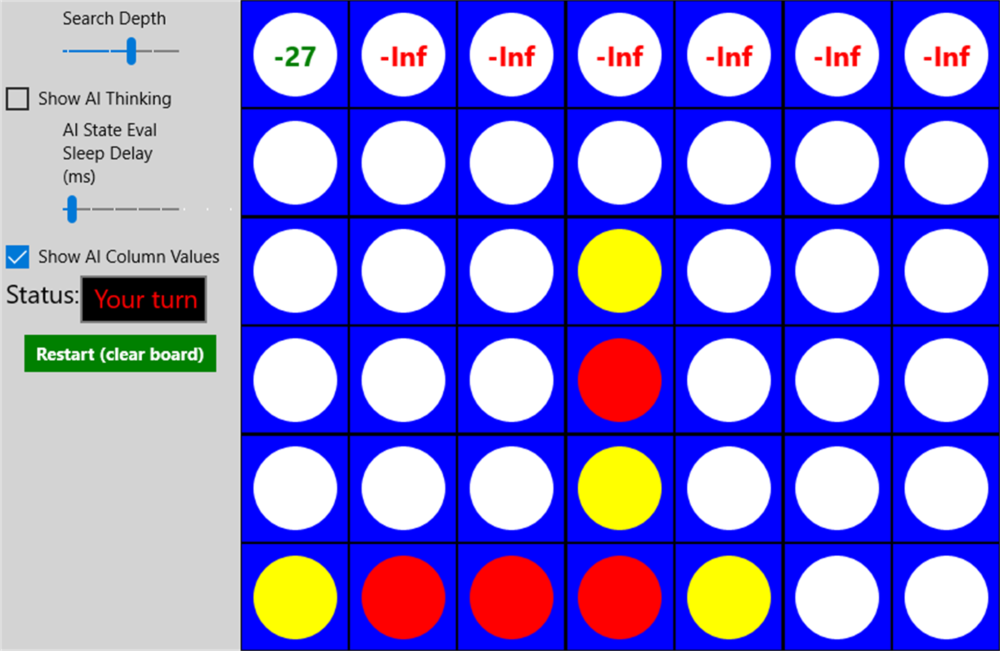

# Connect Four with Visible AI Thinking
A Connect Four game where you can see exactly what the AI opponent is thinking. Made for a second year UWP assignment.

## What is this?
This is a Windows universal app created as an assignment for the Internet & Mobile Applications Development module in my Software Development college course.

## What does it do?
In this app, you play Connect Four against an AI, with a twist: you can see what the AI is thinking for its move. You can see it searching through the game tree and assigning values to game states.

The app also has adjustible settings for search depth, how much delay there is between the AI's searched game states, and more.

This shows the user how AI for these sort of games is made.

## What algorithm is used for the AI?
The AI uses an algorithm known as MinMax. As it searches the game tree, it tries to maximize its "value" of the board while minimizing it's opponents value.

## Now available on the Windows store!
https://www.microsoft.com/en-us/store/p/connect-4-with-visible-ai-thinking/9n9ghdm29g8m
